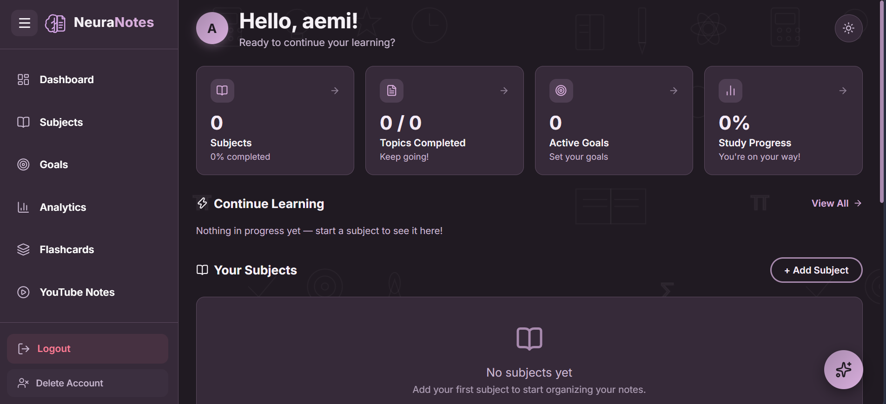
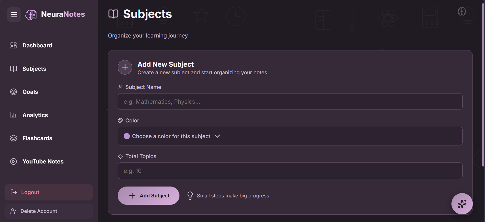
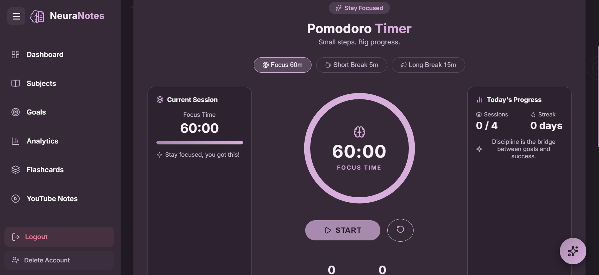
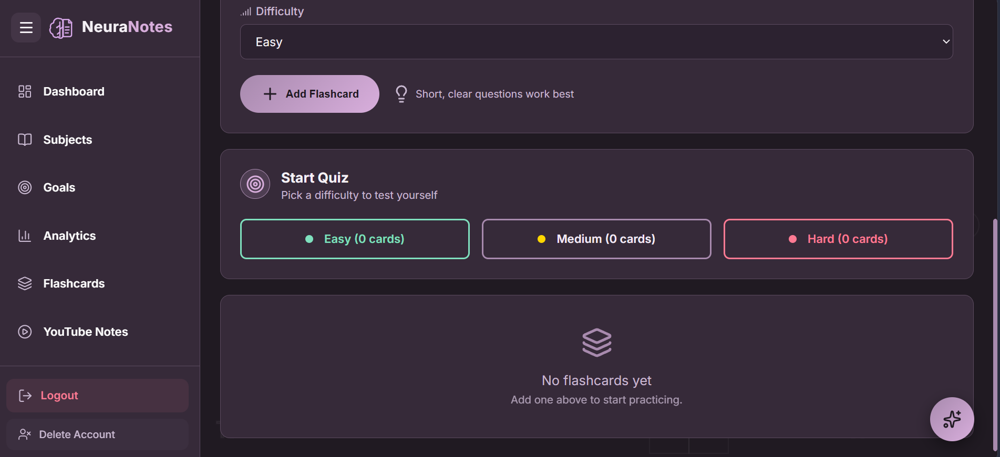
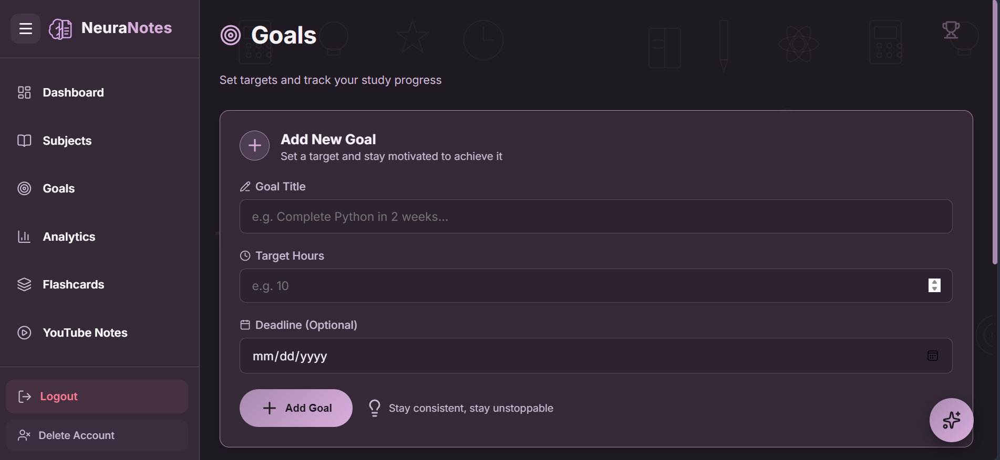
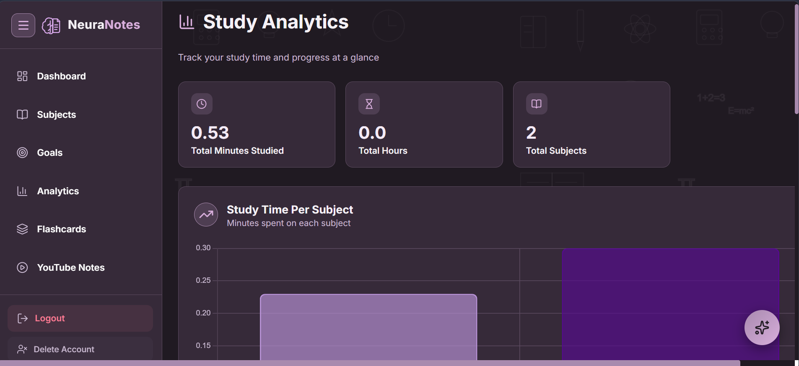
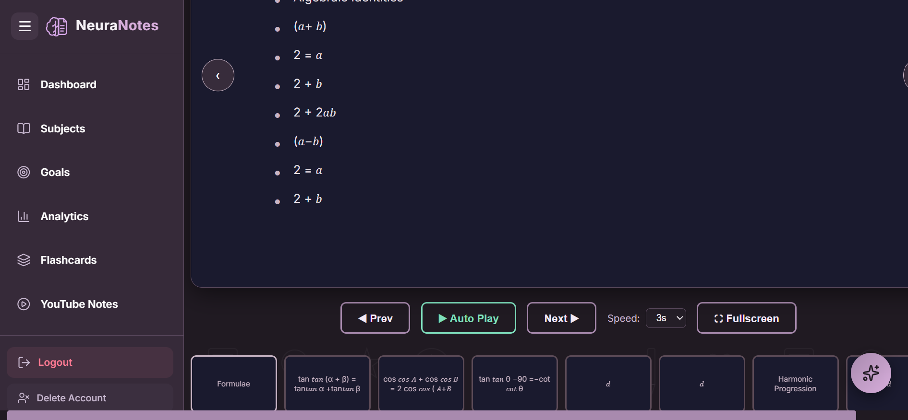
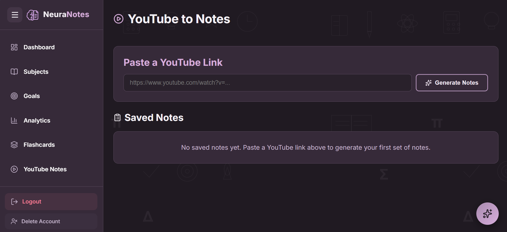
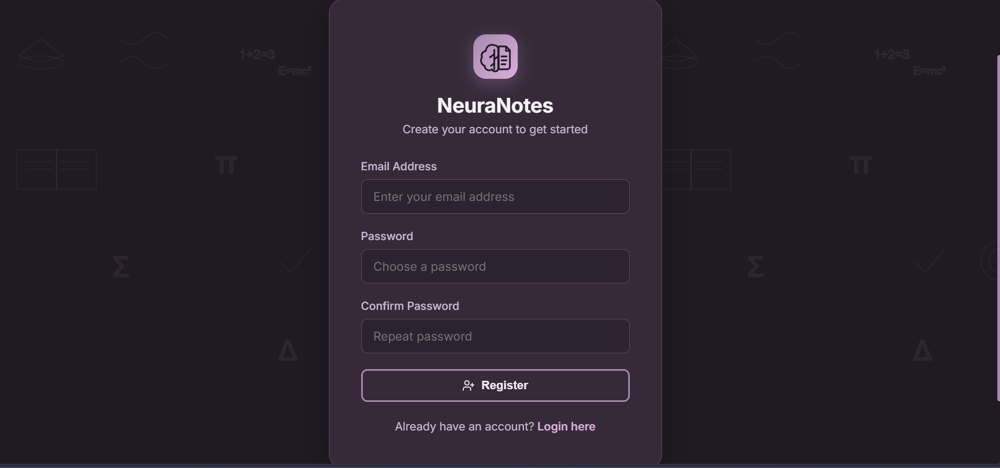
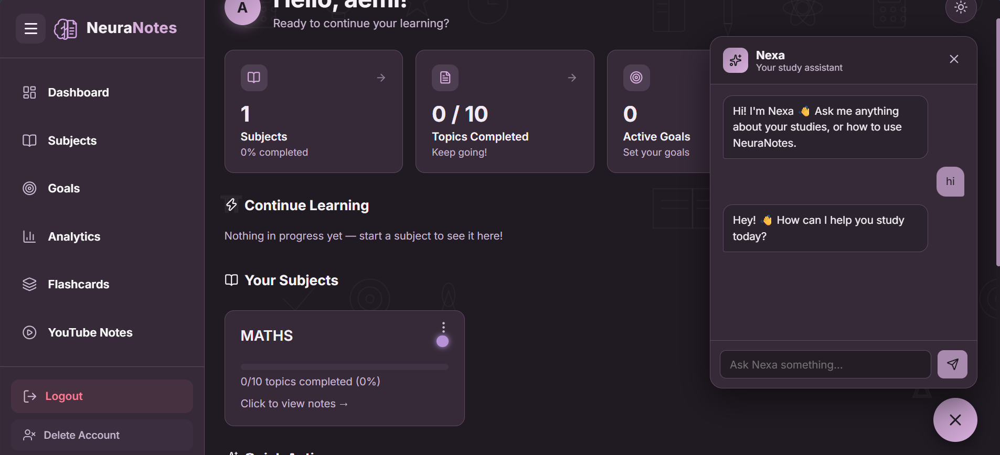

# NeuraNotes

NeuraNotes is a full-stack Flask study companion app. It brings subject organization, rich note-taking, goal tracking, a Pomodoro timer, flashcards, PDF-to-presentation conversion, YouTube-to-notes generation, and an AI study assistant together in one platform.

---

## Live Site

[https://aemi.pythonanywhere.com/](https://aemi.pythonanywhere.com/)

---

## Screenshots

<table>
  <tr>
    <td width="50%">
      
    </td>
    <td width="50%">
      
    </td>
  </tr>
  <tr>
    <td align="center"><b>Dashboard</b></td>
    <td align="center"><b>Subjects</b></td>
  </tr>
  <tr>
    <td width="50%">
      
    </td>
    <td width="50%">
      
    </td>
  </tr>
  <tr>
    <td align="center"><b>Notes & Pomodoro Timer</b></td>
    <td align="center"><b>Flashcards</b></td>
  </tr>
</table>

---

## Tech Stack

| Technology | Purpose |
|---|---|
| Flask | Core backend web framework — routing, request handling, rendering |
| Flask-Session | Server-side session management for user login state |
| SQLite3 | Relational database for users, subjects, notes, goals, flashcards |
| Werkzeug | Password hashing and secure file uploads |
| Jinja2 | HTML templating engine for dynamic pages |
| HTML5 / CSS3 | Structure and styling, with a custom light/dark theme system |
| JavaScript (Vanilla) | Pomodoro timer, rich text editor, theme toggle, image drag/resize, chat widget |
| Lucide Icons | Icon set used throughout the UI |
| Chart.js | Bar and doughnut charts on the Analytics page |
| ReportLab | Generates PDF exports of notes |
| Pillow (PIL) | Image processing for notes and PDF exports |
| PyMuPDF (fitz) | Extracts and renders PDF pages for the PDF-to-Presentation feature |
| Groq API | Powers the in-app AI assistant (Nexa) and YouTube transcript summarization |
| youtube-transcript-api | Fetches YouTube video captions/transcripts |
| yt-dlp | Fallback for fetching captions or video descriptions |
| python-dotenv | Loads environment variables from a `.env` file |
| smtplib (Python stdlib) | Sends account verification emails via Gmail SMTP |
| PythonAnywhere | Hosting platform for the live deployment |

---

## Project Structure

```
neuranotes/
│
├── app.py                       # Main Flask application — all routes & backend logic
├── init_db.py                   # Initializes the SQLite database schema
├── setup_full_db.py             # Full database setup script
├── add_flashcards.py            # Migration: adds flashcards table
├── add_image.py                 # Migration: adds image support to notes
├── add_nexa_columns.py          # Migration: adds Nexa chat usage tracking columns
├── add_verification_columns.py  # Migration: adds email verification columns
├── delete_user.py               # Utility script for removing a user and their data
├── neuranotes.db                # SQLite database (excluded from version control)
├── .env                         # Environment variables — API keys & mail credentials (excluded from version control)
├── .gitignore                   # Files/folders excluded from Git
│
├── static/
│   ├── styles.css                # Global stylesheet (light/dark theme via CSS variables)
│   └── uploads/                  # User-uploaded images (notes, subjects)
│
└── templates/
    ├── layout.html                # Base layout — sidebar, theme toggle, Nexa chat widget
    ├── index.html                 # Dashboard
    ├── login.html                 # Login page
    ├── register.html              # Registration page
    ├── verify.html                # Email verification page
    ├── subjects.html              # Subject management
    ├── notes.html                 # Notes, Pomodoro timer, progress tracking (per subject)
    ├── note_view.html             # Single note viewer
    ├── goals.html                 # Study goals
    ├── analytics.html             # Charts & study statistics
    ├── flashcards.html            # Flashcard subject selection & quiz history
    ├── flashcard_manage.html      # Add/manage flashcards per subject
    ├── flashcard_quiz.html        # Flashcard quiz mode
    ├── pdf_upload.html            # PDF upload page
    ├── pdf_presentation.html      # Generated slide presentation from PDF
    ├── youtube_notes.html         # YouTube-to-notes generator
    └── youtube_note_view.html     # Single YouTube note viewer
```

---

## Feature Screenshots

<table>
  <tr>
    <td width="50%">
      
    </td>
    <td width="50%">
      
    </td>
  </tr>
  <tr>
    <td align="center"><b>Goals</b></td>
    <td align="center"><b>Analytics</b></td>
  </tr>
  <tr>
    <td width="50%">
      
    </td>
    <td width="50%">
      
    </td>
  </tr>
  <tr>
    <td align="center"><b>PDF to Presentation</b></td>
    <td align="center"><b>YouTube to Notes</b></td>
  </tr>
  <tr>
    <td width="50%">
      
    </td>
    <td width="50%">
      
    </td>
  </tr>
  <tr>
    <td align="center"><b>Register / Login</b></td>
    <td align="center"><b>Nexa AI Study Assistant</b></td>
  </tr>
</table>

---

## Features

- Authentication — email/password registration with email-based verification codes
- Subjects — create subjects with custom colors and track topic completion
- Rich Notes — full rich-text editor (headings, bold/italic/underline, lists, highlights, resizable/draggable images) with PDF export
- Pomodoro Timer — focus/short-break/long-break modes with automatic study-time logging
- Goals — set and track study goals with deadlines and target hours
- Analytics — visual breakdown of study time and topic progress per subject
- Flashcards — difficulty-tiered flashcards with timed quizzes and score history
- PDF to Presentation — upload a PDF and convert its pages into a slide-style presentation
- YouTube to Notes — generate structured study notes from a video's transcript or description
- Nexa AI Assistant — an in-app chat assistant powered by Groq for study help and app guidance
- Light/Dark Theme — fully themeable UI with a persistent toggle

---

## Known Limitation — YouTube Notes on the Live Deployment

The YouTube-to-Notes feature works fully in local development, but is not functional on the live PythonAnywhere deployment. PythonAnywhere's free tier restricts outbound internet access to a whitelisted set of domains, and fetching YouTube captions/transcripts requires unrestricted outbound access to YouTube's servers, which is only available on paid plans.

To use this feature, run the app locally, or deploy on a host with unrestricted outbound access.

---

## Environment Variables

The app requires a `.env` file in the project root with the following keys:

```
GROQ_API_KEY=your_groq_api_key
MAIL_USERNAME=your_gmail_address
MAIL_PASSWORD=your_gmail_app_password
```

---

## License

This project is licensed under the MIT License — you are free to use, modify, and distribute this software with proper attribution.
